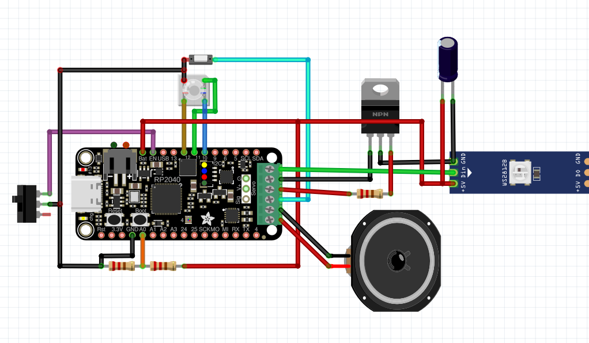

# 🔦 Sabre de Luz em CircuitPython / CircuitPython Lightsaber

[](https://circuitpython.org/)
[](LICENSE)

Projeto por **pcpai83**

---

## 🇵🇹 Português

### Sobre

Este projeto é um **sabre de luz interativo** feito com CircuitPython 9.2.8, baseado na placa [Adafruit RP2040 Prop-Maker Feather com I2S Audio Amplifier](https://www.adafruit.com/product/5768).  
Permite brincar com luzes, sons e movimentos tal como nos filmes — tudo com um só botão, modos especiais, menu de configurações e animações incríveis!

---

## 📊 Esquema de Ligações



**Principais componentes:**
- **RP2040 Prop-Maker Feather**: microcontrolador principal
- **Botão lateral (push button)**: controlo dos modos/efeitos
- **Interruptor ON/OFF**: liga/desliga a energia do sistema
- **Alto-falante (Speaker)**: efeitos sonoros I2S
- **Fita/painel de LEDs WS2812B**: lâmina de luz (Neopixel)
- **Transístor NPN**: comanda a alimentação dos LEDs
- **Condensador**: protege contra picos na alimentação dos LEDs
- **Sensor acelerômetro (LIS3DH)**: para movimentos/sensores de impacto
- **Porta de carregamento USB-C**: carrega a bateria interna

> **Dica:**  
> Respeita a polaridade de alimentação e os valores de resistores/capacitores recomendados nos tutoriais Adafruit para sabres de luz!

---

## ⚡ Funcionalidades

- Lâmina Neopixel (80 LEDs ou mais) com cores, brilho e efeitos personalizáveis
- Efeitos de som realistas (clash, swing, lockup, blast, ignição, etc.)
- Sensor de movimento (acelerômetro LIS3DH)
- Botão lateral para controlar todos os modos e menus
- Interruptor físico ON/OFF (energia) e carregamento USB-C
- Menu de definições com feedback sonoro e visual (cor, brilho, volume, animação…)
- Modos especiais: lockup, blade bleeding, medidor de bateria com LEDs, troca de efeito de ignição

---

## 🚀 Como funciona

- **Só um botão para tudo:** pressões simples, múltiplas e longas, diferentes comandos consoante o estado (ligado, desligado ou menu)
- Arquitetura modular: fácil de alterar, adicionar sons/efeitos e modificar menus
- Carregamento fácil: basta abrir o “pommel” (tampa traseira) e ligar USB-C

---

## 🛠️ Requisitos

- Adafruit RP2040 Prop-Maker Feather (ou similar)
- Lâmina LED WS2812 (Neopixel)
- Alto-falante (Speaker)
- Bateria Li-Ion 18650
- Sensor LIS3DH (acelerômetro I2C)
- Botão push e interruptor ON/OFF
- CircuitPython 9.2.8 +
- Bibliotecas Adafruit CircuitPython (ver `requirements.txt`)

---

## 📁 Organização

```
/code.py             # Código principal do sabre
/settings_menu.py    # Lógica do menu de definições
/sounds/             # Efeitos de som (WAV)
/gfx/                # Animações gráficas (BIN, WAV)
/settings.json       # Configuração guardada do utilizador
```

---

## 🖼️ gfx_bmp2bin — Ferramenta para Animações (BMP ➜ BIN)

Este projeto inclui a pasta gfx_bmp2bin, com:

bmp2bin.py: Script em Python para converter imagens BMP (linhas horizontais de frames) para ficheiros .bin usados como animações da lâmina.

Exemplos de ficheiros .bmp e .bin para demonstração.

Como usar
Coloca as tuas animações BMP na pasta.

Corre o script para converter:

python bmp2bin.py "pasta" "num_leds"

pasta: Caminho da pasta com BMPs.

num_leds: Quantos LEDs tem a tua lâmina.

O script lê cada BMP, redimensiona para o número de LEDs, e gera um .bin pronto para usar no sabre.

⚡ Tinting (Personalização de cor nas animações)
Se o tinting estiver ativo numa animação (definido no JSON dessa animação), a cor da animação será alterada para usar apenas a banda de vermelho puro, isto é, toda a escala entre:

preto (1,0,0)

vermelho escuro (128,0,0)

vermelho puro (255,0,0)

rosa claro (255,128,128)

quase branco (255,254,254)

Assim, o efeito pode ser “tingido” dinamicamente conforme a cor da lâmina definida no menu ou pelo código.

---

## 🙌 Créditos

Projeto de hardware, firmware e 3D por **pcpai83**  
Inspirado em projetos DIY de lightsaber e na comunidade Adafruit.

---

## 🇬🇧 English

### About

This project is an **interactive lightsaber** using CircuitPython 9.2.8 and the [Adafruit RP2040 Prop-Maker Feather with I2S Audio Amplifier](https://www.adafruit.com/product/5768).  
Enjoy movie-like light, sound and motion — all with a single button, special modes, onboard settings menu and cool FX animations!

---

## 📊 Wiring Diagram


**Main Components:**
- **RP2040 Prop-Maker Feather**: main microcontroller
- **Side push button**: controls modes/effects
- **ON/OFF switch**: system power control
- **Speaker**: sound effects via I2S
- **WS2812B LED strip/blade**: lightsaber blade (Neopixel)
- **NPN transistor**: switches LED power
- **Capacitor**: protects LEDs from voltage spikes
- **Accelerometer (LIS3DH)**: for motion/swing detection
- **USB-C charging port**: charges internal battery

> **Tip:**  
> Always follow Adafruit's recommended resistor and capacitor values for Neopixel circuits!

---

## ⚡ Features

- Neopixel LED blade (80+ LEDs), customizable color, brightness and effects
- Realistic sound FX (clash, swing, lockup, blast, ignition, etc.)
- Motion sensing (LIS3DH accelerometer)
- Side push button for all modes and menu navigation
- Physical ON/OFF switch (power) and USB-C charging
- Settings menu with audio/visual feedback (color, brightness, volume, animation…)
- Special modes: lockup, blade bleeding, LED battery meter, ignition FX cycling

---

## 🚀 How it works

- Single-button operation: short, multiple and long presses trigger different actions, depending on the saber state (on/off/menu)
- Modular software: easy to add new sounds, FX and menu options
- Easy charging: just unscrew the pommel and connect USB-C

---

## 🛠️ Requirements

- Adafruit RP2040 Prop-Maker Feather (or compatible)
- WS2812 Neopixel LED blade
- Speaker
- 18650 Li-Ion battery
- LIS3DH accelerometer (I2C)
- Push button & ON/OFF switch
- CircuitPython 9.2.8 +
- Adafruit CircuitPython libraries (see `requirements.txt`)

---

## 📁 Structure

```
/code.py             # Main saber firmware
/settings_menu.py    # Onboard settings menu logic
/sounds/             # Sound effects (WAV)
/gfx/                # Graphical FX (BIN, WAV)
/settings.json       # User configuration file
```

---

## 🙌 Credits

Hardware, firmware & 3D design by **pcpai83**  
Inspired by DIY lightsaber projects and the Adafruit community.

---

## 📦 Quick Install

1. Install CircuitPython 9.2.8 on the Feather RP2040 Prop-Maker
2. Copy all files to the board (`code.py`, `settings_menu.py`, `sounds/`, `gfx/`, etc.)
3. Add all required libraries to the `lib/` folder
4. (Optional) Personalize sounds and effects!

---

## 🖼️ gfx_bmp2bin — Animation Tool (BMP ➜ BIN)

This project includes the gfx_bmp2bin folder, with:

bmp2bin.py: Python script to convert BMP images (horizontal frame strips) into .bin animation files for the blade.

Demo .bmp and .bin files included.

How to use
Put your BMP animation images in the folder.

Run the script to convert:

python bmp2bin.py "folder" "num_leds"
folder: Path to your BMP files folder.

num_leds: Number of LEDs in your blade.

The script reads each BMP, resizes each frame to match your LED count, and outputs a ready-to-use .bin animation file.

⚡ Tinting (Dynamic Animation Coloring)
If tinting is enabled for an animation (set in the animation's JSON), the colors will use only the pure red color band, meaning the animation will map between:

black (1,0,0)

dark red (128,0,0)

pure red (255,0,0)

light pink (255,128,128)

near-white (255,254,254)

This allows for dynamic "tinting" effects that follow the blade color chosen in the menu or set by code.

---

## 📝 License

MIT License
